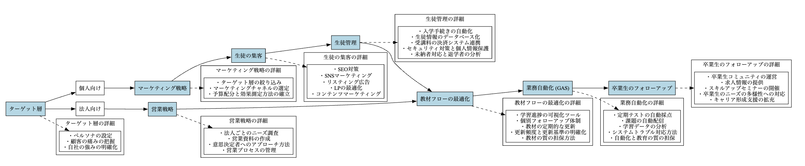

# イントロダクション

## 目次
- [イントロダクション](#introduction)
  - [1.1 生成AIの教育ニーズの高まり](#increasing-demand)
  - [1.2 生成AI活用の塾ビジネスの概要と目的](#overview-purpose)
  - [1.3 収益実績](#revenue)

## イントロダクション

近年、人工知能（AI）技術の急速な発展により、様々な業界でAIを活用したビジネスが注目を集めています。教育業界においても、AIを活用することで、効率的かつ効果的な学習支援が可能になると期待されています。本講習では、生成AIを活用した塾ビジネスについて、その概要と目的、および収益実績について解説します。

### 1.1 生成AIの教育ニーズの高まり

IT x 教育のニーズはかねてよりありました。

1. 個別最適化された学習支援へのニーズの高まり
   - 生徒一人一人の学習状況や理解度に合わせた、個別最適化された学習支援が求められています。生成AIを活用することで、生徒の特性に応じた教材の自動生成が可能になり、このニーズに応えることができます。
   - 新型コロナウイルス感染症の拡大により、オンライン教育へのシフトが加速し、生徒の自主学習をサポートする効果的な教材の提供が重要になっています。生成AIを活用した教材開発のニーズが高まっています。

2. 教育の効率化と質の向上への期待
   - 教師の負担を軽減し、教育の効率化を図ることが求められています。生成AIを導入することで、教材作成や採点などの作業を自動化し、教師が生徒指導により注力できるようになります。これにより、教育の質の向上が期待できます。
   - EdTech（Education Technology）の発展により、教育とテクノロジーを融合させた取り組みが注目を集めています。生成AIはEdTechの中核をなす技術の一つであり、教育業界におけるAI活用の機運が高まっていることが、生成AIの教育ニーズを後押ししています。

3. 生成AIリテラシー教育の必要性
   - 生成AIを教育現場で効果的に活用するためには、教師だけでなく、生徒自身もAIリテラシーを身につける必要があります。生徒が生成AIの特性を理解し、適切に利用できるようになることで、AIを活用した学習の効果がさらに高まることが期待されます。
   - そのため、生成AIリテラシー教育に対するニーズが高まっています。AIの基礎知識から、生成AIの活用方法、倫理的な考え方まで、包括的なリテラシー教育プログラムの開発が求められています。

近年、生成AIの教育ニーズが高まっている背景には、以下のような要因があります。

5. 生成AIの学習ニーズと課題
- 生成AIはビジネスの現場で大きな可能性を秘めており、業務の効率化や生産性の向上に寄与するため、ビジネスパーソンの学習ニーズが高まっています。生成AIを活用することで、レポート作成や顧客対応などの作業を自動化し、従業員の負担を大幅に軽減できます。これにより、従業員はより高度な業務や戦略的な意思決定に注力でき、ビジネスの競争力強化が期待できます。

- ただし、生成AIを適切に活用するためには、ビジネスパーソン自身がAIリテラシーを身につける必要があります。生成AIはときに不正確な情報（ハルシネーション）を生成することがあるため、その限界を理解し、適切に活用するためのガイドラインの整備が求められています。ビジネスパーソンがこれらのスキルを習得することで、生成AIの効果的な活用が可能になり、業務の効率化とビジネスの競争力強化を両立できるでしょう。

6. 生成AIリテラシー教育の必要性

- 生成AIはビジネスの現場で強力なツールとなり得ますが、その使いこなしノウハウはまだ十分に確立されておらず、リスクに関する教育も不足しています。ビジネスパーソンが生成AIを適切かつ効果的に活用するためには、AIリテラシーを身につけることが不可欠です。

- そのため、企業内での生成AIリテラシー教育に対するニーズが高まっています。AIの基礎知識から、生成AIの活用方法、倫理的な考え方、リスクの理解と管理まで、包括的なリテラシー教育プログラムの開発が求められています。また、生成AIを使いこなすために必要な能力の定義と評価方法の確立も重要な課題です。企業はこうしたリテラシー教育を通じて、従業員のAI活用能力を向上させ、ビジネスの競争力を高めることができるでしょう。

生成AIを活用した塾ビジネスは、これらの教育ニーズに応えることができる革新的なビジネスモデルとして注目を集めています。今後、さらに多くの塾がこの技術を導入し、教育業界に変革をもたらすことが期待されています。ただし、生成AIの課題や限界を踏まえ、適切な活用方法を確立することが重要です。生成AIリテラシー教育を通じて、教師と生徒がAIを正しく理解し、活用できるようになることが、生成AI教育の発展に不可欠だと言えるでしょう。

### 1.2 生成AI活用の塾ビジネスの概要と目的

生成AIとは、大量のデータを学習し、新しいデータを生成することができるAIの一種です。この技術を塾ビジネスに活用することで、以下のようなメリットが期待できます。

| メリット | 説明 |
|----------|------|
| 個別最適化された学習教材の提供 | - 生徒一人一人の学習状況や理解度に合わせて、最適な教材を自動生成することができます。 - これにより、生徒の学習効率が向上し、学力の向上が期待できます。 |
| 教師の負担軽減 | - 教材作成や採点などの作業を自動化することで、教師の負担を大幅に軽減できます。 - 教師は生徒とのコミュニケーションや指導に集中できるようになります。 |
| 低コストでの運営 | - AIを活用することで、人件費を抑えつつ、質の高い教育サービスを提供することができます。 - これにより、塾ビジネスの収益性が向上します。 |

生成AI活用の塾ビジネスの目的は、AIの力を借りて、生徒一人一人に最適な学習環境を提供し、学力向上と教育の質の向上を実現することです。同時に、教師の負担を軽減し、低コストでの運営を可能にすることで、塾ビジネスの収益性を高めることも目指しています。

### 1.3 収益実績

この収益実績は、以下の要因によるものと考えられます。

1. 生徒数の増加
   - 生成AIを用いたマーケティング施策により、潜在顧客へのアプローチが効果的に行われ、新規生徒の獲得につながりました。生成AIを活用したターゲティング広告や、魅力的なバナー画像の自動生成などが功を奏しました。
   - AIを活用した学習支援により、塾の教育の質が向上し、評判が広まったことで、生徒数が増加しました。

2. コスト削減
   - AIの活用により効率的な運営が可能になったことで、コストが削減されました。
   - マーケティングやシステム開発にかかる費用を抑えることで、講師への還元率を高めることができます。生成AIを活用することで、マーケティング資料の作成や教材開発を自動化でき、コストを大幅に削減できます。これにより、講師への報酬を増やし、優秀な人材を確保しやすくなります。

   - 具体的には、以下のような施策が考えられます：

     1. 生成AIを用いたマーケティング資料の自動生成
        - ブログ記事、SNS投稿、メールマガジンなどのマーケティング資料を生成AIで自動生成することで、人件費を削減できます。
        - 生成AIにより、大量のコンテンツを短時間で作成できるため、マーケティングの効率が大幅に向上します。

     2. 生成AIを活用した教材開発の自動化
        - 生徒のレベルに合わせた教材を生成AIで自動生成することで、教材開発にかかる時間とコストを削減できます。
        - 生成AIを用いることで、教材のバリエーションを増やすことができ、生徒の学習意欲を高めることができます。

     3. 講師への還元率の向上
        - マーケティングやシステム開発にかかるコストを削減することで、浮いた資金を講師への報酬に充てることができます。
        - 講師への還元率を高めることで、優秀な講師を確保し、教育の質を向上させることができます。

   生成AIを活用したマーケティングや教材開発の自動化により、コスト削減と効率化を実現し、講師への還元率を高めることができます。これにより、優秀な講師を確保し、教育の質を向上させることが可能になるでしょう。
