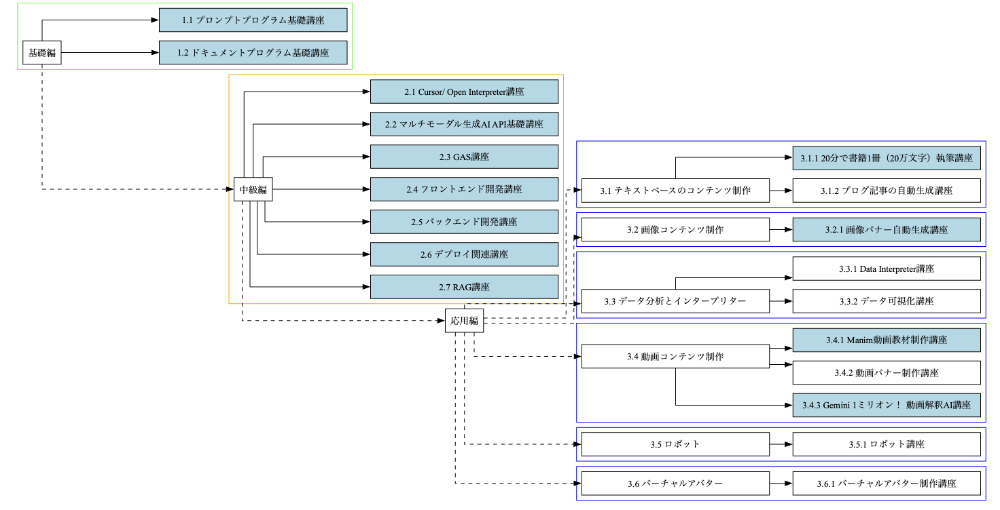

# 講師業務と教材開発

## 目次
1. [講師業務と教材開発とは](#introduction)
2. [講師の役割と責任](#roles-responsibilities)
3. [カリキュラム作成と教材開発](#curriculum-materials)
   - [生徒のレベルに合わせた教材の設計](#student-level-materials)
   - [無料教材を用いた集客方法](#free-materials-marketing)
4. [授業の進め方とコミュニケーション術](#teaching-communication)
5. [生徒の学習進捗管理と評価](#progress-evaluation)

## 講師業務と教材開発とは
講師業務と教材開発は、教育の質を高め、生徒の学習効果を最大化するために不可欠な要素です。講師は、生徒の学習目標を理解し、それに沿ったカリキュラムを作成する必要があります。また、生徒のレベルに合わせた教材を開発し、効果的な授業を行うことが求められます。

[目次に戻る](#toc)

## 講師の役割と責任
講師の主な役割と責任は以下の通りです：

| 講師の役割と責任 | 説明 |
|-----------------|------|
| カリキュラム作成 | 生徒の学習目標を理解し、それに沿ったカリキュラムを作成する |
| 教材開発と授業 | 生徒のレベルに合わせた教材を開発し、効果的な授業を行う |
| 学習意欲の向上 | 生徒の興味を引き出し、学習意欲を高めるような工夫を取り入れる |
| コミュニケーションとフィードバック | 授業中のコミュニケーションを通じて、生徒一人一人の特性を理解し、適切なフィードバックを与える |
| 学習進捗の評価と調整 | 生徒の学習進捗を定期的に評価し、必要に応じてカリキュラムや教材を調整する |
| 自己研鑽 | 自身の知識とスキルを常に更新し、生徒のニーズに合わせた教育を提供する |

[目次に戻る](#toc)

## カリキュラム作成と教材開発

### 生徒のレベルに合わせた教材の設計
生徒のレベルに合わせた教材を設計するためには、以下の点に留意する必要があります：

| 手順 | 内容 |
|-----|------|
| 1 | 生徒の現在のスキルレベルを正確に把握する |
| 2 | 学習目標を明確に設定し、それに沿った教材を作成する |
| 3 | 生徒の興味や関心を考慮し、魅力的な教材を開発する |
| 4 | 視覚的要素やインタラクティブな活動を取り入れ、生徒の積極的な参加を促す |
| 5 | 生徒のフィードバックを収集し、教材の改善に活用する |

### 無料教材を用いた集客方法
無料教材を活用することで、潜在的な生徒を引き付け、集客につなげることができます。以下は、無料教材を用いた集客方法の例です：

| 無料教材を用いた集客方法 | 説明 |
|--------------------------|------|
| ブログやSNSでの公開 | ブログやソーシャルメディアで無料教材を公開し、生徒の興味を引き付ける |
| メールマガジンでの配布 | メールマガジンで無料教材を配布し、購読者を増やす |
| 無料ウェビナー・オンラインセミナー | 無料ウェビナーやオンラインセミナーを開催し、生徒との関係を構築する |
| 無料体験レッスンの提供 | 無料体験レッスンを提供し、生徒に教材の質を実感してもらう |
| 口コミの活用 | 口コミを活用し、無料教材の価値を広める |
[目次に戻る](#toc)

## 授業の進め方とコミュニケーション術
効果的な授業を行うためには、以下の点に注意する必要があります：

| 効果的な授業のポイント | 説明 |
|------------------------|------|
| 生徒一人一人の特性の理解 | 生徒一人一人の特性を理解し、適切なコミュニケーションを取る |
| 双方向のコミュニケーションの促進 | 生徒の質問や意見に耳を傾け、双方向のコミュニケーションを促進する |
| 授業ペースの調整 | 生徒の学習進捗に合わせて、授業のペースを調整する |
| 小さな成功体験の積み重ね | 生徒の達成感を高めるために、小さな成功体験を積み重ねる |
| 適切なフィードバックの提供 | 生徒の学習意欲を維持するために、適切なフィードバックを与える |
[目次に戻る](#toc)

## 生徒の学習進捗管理と評価
生徒の学習進捗を管理し、適切に評価するためには、以下の点に留意する必要があります：

| 手順 | 内容 |
|------|------|
| 1 | 学習目標に沿った評価基準を設定する |
| 2 | 定期的に生徒の学習進捗を評価し、記録する |
| 3 | 生徒の強みと弱みを特定し、適切なフィードバックを与える |
| 4 | 必要に応じて、カリキュラムや教材を調整し、生徒の学習効果を最大化する |
| 5 | 生徒の成長を認め、モチベーションを高める |

[目次に戻る](#toc)